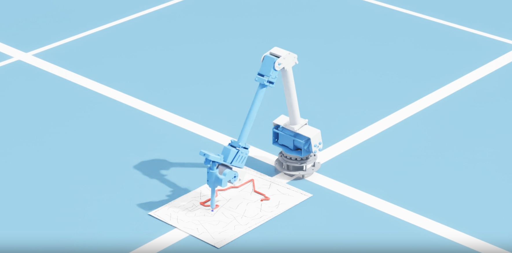

# Maze



- Task：将摄像头拍摄的「白纸黑笔迷宫」照片重建成扫描件，做起点→终点路径规划。
- Sim：Isaac Sim 中让 5-DOF 机械臂用笔沿规划路径描画、渲染成视频。
- Real：通过上下位机 TCP 通信驱动真实机械臂执行轨迹。
- 起点用**红笔**标记，终点用**蓝笔**标记。

## 0.总览

### 目录结构

> 所有命令都在仓库根目录 `Maze/` 下运行。

```
maze_planner/            迷宫重建 + 路径规划模块
  maze_scanner.py        重建流水线（5 步）
  maze_planner.py        路径规划（占用栅格 + A*）
  make_sample.py         生成合成测试照片（透视倾斜 + 不均匀光照 + 红/蓝标记）
  environment.yml        maze conda 环境定义
  samples/               测试输入照片（maze_photo.jpg, test_0.jpg）
  outputs/               规划产物（每次覆盖）
    image/               中间图（0_input ~ 6_occupancy）+ planned.png（轨迹投影结果图）
    trajectory/          关节轨迹文件（trajectory.json）
arm_sim/                 机械臂仿真绘制模块（Isaac Sim）
  arm_kinematics.py      5-DOF 正/逆运动学（纯 numpy）
  record_video.py        关节正弦运动演示
  draw_circle.py         画圆（验证 FK/IK）
  draw_maze.py           沿迷宫解路径描画
  run_draw_maze.sh       Slurm 提交脚本
  video/                 仿真渲染的 mp4（arm_motion / arm_draw_circle / arm_draw_maze）
  logs/                  Slurm 日志（git 忽略）
urdf/                    机械臂模型
  five_dof_arm.urdf      5 个旋转关节，参数与 arm_kinematics 对应
  meshes/                各连杆 STL
arm_real_client/         实机控制 - 上位机（本机）
  robot_config.py        下位机 IP / 端口集中配置（改地址只动这里）
  robot_client.py        RobotClient 封装（ping/joint/trajectory/status/stop）
  test_client.py         发送轨迹示例
  draw_maze_real.py      迷宫→IK→关节轨迹→实机下发（一键，见 4.7）
  estop.py               一键软停（见 4.8）
arm_real_server/         实机控制 - 下位机（部署到 Windows）
  robot_server.py        Windows 端：限幅 / 逐点闭环到位 / pyserial 直连 COM4
```

走迷宫任务相关的所有文件都保存在本仓库内。

### 环境

```bash
conda env create -f maze_planner/environment.yml   # 创建 maze 环境
conda activate maze
```

环境装的是带 GUI 窗口的 `opencv-python`（非 headless），手动点选纸角的弹窗依赖它。
如果用的是 `opencv-python-headless`，弹窗会报 `The function is not implemented. Rebuild the library with ... GTK+ support`——这时要么换成非 headless 版，要么加 `--auto` 跳过点选。

### 使用

`maze_planner.py` 一步完成「重建 + 规划」（内部先跑重建流水线、再做路径规划），输出带路径的结果图：

```bash
# 处理你自己的照片：默认弹窗手动点选 4 个纸角
python maze_planner/maze_planner.py input.jpg -o planned.png

# 不想手动点选时：
python maze_planner/maze_planner.py input.jpg -o planned.png --auto   # 自动检测纸角
python maze_planner/maze_planner.py input.jpg -o planned.png \
       --corners "x1,y1 x2,y2 x3,y3 x4,y4"                            # 直接给坐标(原图像素)

# 合成图自测（边缘干净，用 --auto 免去弹窗）
python maze_planner/make_sample.py
python maze_planner/maze_planner.py maze_planner/samples/maze_photo.jpg -o planned.png --auto
```

说明：手动选点需要图形界面。`--corners` 的坐标是**原图**像素，顺序任意（程序会自动排成
左上/右上/右下/左下）。各步骤中间图默认保存到 `outputs/image`（每次覆盖），`--debug DIR` 可改目录。

#### 远程使用（SSH + X11 转发）

上位机为无头、通过 SSH 远程用时，手动点选窗口靠 X11 转发显示到本地：

1. 用 `ssh -X`（或更宽松的 `-Y`）登录，让服务器的窗口转发到本地。
2. 本地要有 X server：Windows 11 + WSL2 自带 WSLg，开箱即用；Win10 / 无 WSLg 需装
   VcXsrv 或 X410 并启动。
3. 测链路：远程跑 `xeyes`，本地能弹出一双眼睛就说明通了。
4. **如果在 tmux / screen 里**：复用旧会话时 `DISPLAY` 可能还是过期的空值（会话创建时被
   冻结了），导致弹窗失败。从会话缓存刷新到当前 shell：
   ```bash
   export DISPLAY=$(tmux show-environment | sed -n 's/^DISPLAY=//p')   # tmux
   ```
5. 然后照常 `python maze_planner/maze_planner.py input.jpg -o planned.png`。

NOTE：

- 弹窗时出现 `QFontDatabase: Cannot find font directory` 是无害警告，可忽略。

## 1.重建 (maze_scanner.py)

1. 确定纸张四角（**默认手动点选**，最可靠）：弹窗后左键依次点 4 个角，
   `u`/退格撤销、回车确认、Esc 取消。可选 `--auto` 改用自动检测（亮度+低饱和分割
   →取含画面中心的连通块→凸包求四边形），或 `--corners` 直接传坐标跳过选点。
2. 透视矫正（四点透视变换拉正，角点向内缩 `margin` 去掉边缘桌面/阴影）
3. 亮度/对比度增强（背景除法去阴影 + CLAHE）
4. 黑白二值化（自适应阈值）
5. 连通域清噪，输出纯黑白扫描件（墙=黑，纸=白）

## 2.路径规划 (maze_planner.py)

1. 从彩色矫正图检测起点(红)/终点(蓝)标记
2. 二值图 → 占用栅格：抹掉标记黑块 → 闭运算补墙缝 → 按机器人半径膨胀墙体 → 降采样
3. A*（8 邻接，禁止对角穿墙缝）搜索
4. 把路径画回彩色图保存

可调参数：`--inflate` 机器人半径(**栅格格数**，与分辨率无关，默认1；调大更安全但易堵)、
`--close` 补墙缝核(默认5)、`--grid-max` 搜索栅格最长边(默认400)。
排查时看 `outputs/image/6_occupancy.png`（白=可走）确认墙体连续、通道没被堵死
（`--debug` 默认输出到 `outputs/image`，每次覆盖）。

## 3.机械臂仿真绘制 (arm_sim)

把规划好的迷宫路径交给一只 5-DOF 机械臂，在 NVIDIA Isaac Sim 里用笔竖直地描出来，
离屏渲染成 mp4。三个脚本（视频都输出到 `arm_sim/video/`）：

- `record_video.py`  —— 5 个关节按正弦编排自由运动，纯演示 → `arm_sim/video/arm_motion.mp4`
- `draw_circle.py`   —— 笔尖在纸面上画一个圆，验证 FK/IK 链路 → `arm_sim/video/arm_draw_circle.mp4`
- `draw_maze.py`     —— 自动解算 `samples/test_0.jpg` 的迷宫路径，再让笔尖沿路径描画
  （内部调用第二步的规划，固定 `auto=True` 不弹窗）→ `arm_sim/video/arm_draw_maze.mp4`

运动学在 `arm_kinematics.py`（纯 numpy，不依赖 Isaac）：

- FK 按 URDF 里各关节的变换链式相乘，已和 Isaac 实际笔尖位姿对拍到 0.00mm
- IK 用两段式阻尼最小二乘：先把笔尖收敛到目标位置，再加「笔轴竖直向下」约束
- 全程纯运动学控制（直接设关节角），关掉重力，不依赖连杆质量惯量

### 3.1环境与运行

仿真依赖 NVIDIA Isaac Sim（这里用 conda 环境 `dexbench`，已装 Isaac Sim 5.1 +
`opencv-python-headless` + imageio），和上面 maze 用的 `opencv-python` 是**两套独立环境**
（一个无头渲染、一个带 GUI 点选，互不混用）。

```bash
# 在 Slurm 集群上提交（推荐，自动申请 GPU）
sbatch arm_sim/run_draw_maze.sh
#   日志: arm_sim/logs/draw_maze_<JOBID>.log    视频: arm_sim/video/arm_draw_maze.mp4

# 或在有 GPU 的机器上直接跑
export OMNI_KIT_ACCEPT_EULA=YES        # 接受 Omniverse EULA（首次必需）
conda activate dexbench
python arm_sim/draw_maze.py            # 或 draw_circle.py / record_video.py（输出到 arm_sim/video/）

# 只校验 FK/IK + 取景一帧（不出整段视频，快）
MAZE_FRAMETEST=1 python arm_sim/draw_maze.py
```

## 4.实机控制（真实机械臂）

前三步都在上位机（这台跑规划/仿真的机器）完成。要把规划好的关节轨迹发给**真实机械臂**，
还需要一台下位机。下位机是 **Windows**：机械臂通过 USB-C 接 Windows，识别为
`USB-SERIAL CH340 (COM4)`（另需 12V DC 单独供电，USB-C 只做通信）。`robot_server.py` 直接在
Windows 上用 pyserial 读写 COM4、并对上位机提供 TCP 接口——一个进程搞定，无需 WSL / 串口桥 / portproxy。

### 4.1 通信链路

```text
上位机 robot_client.py
    ↓ TCP（tailscale，对外 9001）
下位机 Windows robot_server.py :9001   （关节限幅 / 逐点闭环到位 / 状态查询 / stop）
    ↓ pyserial COM4 @ 115200
机械臂主控板
```

仓库里的文件对应链路里的角色：

| 仓库文件                            | 部署到         | 角色                                           |
| ----------------------------------- | -------------- | ---------------------------------------------- |
| `arm_real_client/robot_config.py` | 上位机（本机） | 下位机 IP / 端口集中配置（改地址只动这里）     |
| `arm_real_client/robot_client.py` | 上位机（本机） | 发请求的客户端封装                             |
| `arm_real_server/robot_server.py` | 下位机 Windows | 收轨迹、限幅、逐点闭环到位、pyserial 直写 COM4 |

### 4.2 底层协议与关节限幅

机械臂底层是单行 JSON 串口协议，`T=122` 表示按角度控制关节：

```json
{"T":122,"b":0,"s":0,"e":0,"w":0,"h":0,"spd":10,"acc":10}
```

`b` 底盘 base、`s` 肩 shoulder、`e` 肘 elbow、`w` 腕 wrist、`h` 末端、`spd` 速度、`acc` 加速度。
robot_server 会对每个关节做限幅（`make_arm_cmd`）：

```text
b: -180~180   s: -90~90   e: -90~90   w: -90~90   h: -180~180
```

> 注：原装 `h` 是夹爪（±45）。本机已**拆除夹爪、换成与笔固定的旋转连接件**，所以 `h` 现在是
> 「笔旋转关节」、限幅放宽到 ±180。画竖直笔的 IK 解需手腕 `w` 约 -93°，超 ±90 的部分被 clamp
> 到 -90（笔约 3° 恒定倾斜，画线无碍）；若确认手腕舵机物理能转过 ±90，可放宽 `w`。

### 4.3 启动顺序（每次实机运行前）

1. **下位机 Windows** 起 robot server（pyserial 直连 COM4、监听 9001），窗口别关：

   ```powershell
   python robot_server.py
   ```

   正常输出 `[OK] Opened serial COM4 @ 115200` /
   `[OK] robot_server (Windows direct-serial) listening on 0.0.0.0:9001`。
   首次需 `pip install pyserial`；Windows 防火墙放行 9001（一次性）。
2. **上位机** 用 robot_client 发指令。下位机经 **tailscale** 接入，IP 固定为 `100.127.110.20`
   （已配在 `robot_config.py`，`RobotClient()` 默认就用它）：

   ```python
   from robot_client import RobotClient
   robot = RobotClient()              # host/port 取自 robot_config
   print(robot.ping())
   pts = [{"b": 0,  "s": 0, "e": 0, "w": 0, "h": 0},
          {"b": 30, "s": 0, "e": 0, "w": 0, "h": 0},
          {"b": 0,  "s": 0, "e": 0, "w": 0, "h": 0}]
   print(robot.trajectory(pts, dt=1.0, traj_id="test", spd=10, acc=10))
   print(robot.status())
   ```

   连通性自测：`nc -vz 100.127.110.20 9001`。

### 4.4 上位机请求类型

robot_client 提供 `ping / joint / trajectory / status / state / stop`：

- **ping** → `{"ok":true,"msg":"pong"}`，测通信。
- **joint**：单点控制 `{"type":"joint","b":30,...,"spd":10,"acc":10}`，server 限幅后转成 `T=122`
  串口指令。轨迹执行期间会拒绝单点（需先 stop）。
- **trajectory**：异步下发整条轨迹（`points` + `dt` + `spd/acc`）。返回 `accepted` 只表示**已接收，
  不代表执行完成**；server 用独立线程**逐点闭环**执行——发一个点后轮询 `T=105` 状态、检测「角度收敛」
  （机械臂停止运动）才发下一个；探测不到状态返回时回退按 `dt` 定时。
- **status**：查本地执行状态 `server_state`，字段 `status`（idle/running/done/stopped/error）、
  `traj_id`、`current_index`、`total_points` 等。
- **state**：向机械臂查 `T=105`（当前主控板未稳定返回，系统不依赖它，以本地 `server_state` 为准）。
- **stop**：置 stop 标志，阻止继续下发后续轨迹点。**注意不是物理急停**，已发给主控板的当前目标点不会撤回。

### 4.5 已验证 & 已知现象

已验证：单点 base 0→30→0、上位机经 9001 连通、trajectory 逐点闭环到位、status 查询、stop 中断。

实测硬件坑（决定了到位判据的实现）：

- **`s`(肩)关节 `T=105` 返回符号与指令相反**（步进电机符号约定不同），但**实际动作方向正确**，
  只是状态读数符号反——画图不受影响，无需改 `draw_maze_real`。
- **`move` 字段不可靠**：机械臂停止后仍可能 `=1`，不能拿来判到位。
- **`e` 在 0° 附近约 3.5° 稳态误差**（重力下垂）。
- 因此 robot_server 用「**角度收敛**（关节不再变化=已停止）」判到位，而非比对目标角或看 `move`。
- **串口物理要稳**：机械臂猛动时曾拉扯 USB 线 / 供电波动导致串口瞬断（**数据线没插好时
  `T=105` 返回全 `\x00`**）；接线插牢、12V 供电稳。`robot_server` 已对 `SerialException` 容错。

排错要点：

- 上位机连不上 9001 → 查 Windows 防火墙是否放行 9001、tailscale 是否在线。
- `T=105` 读不到 / 返回 `\x00` → 多半是数据线/接线问题（RX 没接好），换线试。
- 单点能动、trajectory 不动 → 确认新轨迹开始 `stop_event.clear()`、等待用 `stop_event.wait(dt)`
  而非 `time.sleep(dt)`（已在 robot_server 实现）。

### 4.6 后续可改进

回安全姿态 `safe_home`、更强急停、日志落盘、robot_server 开机自启、画线连续流式（不逐点等到位、
更流畅）、轨迹合法性检查（最大步长 / 速度 / 点数）。

### 4.7 从迷宫到实机绘制（一键脚本 draw_maze_real.py）

`arm_real_client/draw_maze_real.py` 把整条链路串起来：迷宫照片 → maze_planner 规划路径
→ 弧长重采样 → 纸面物理坐标 → arm_kinematics 的 5-DOF IK 解关节角 → 映射到 b/s/e/w/h → 下发。
关节对应：URDF joint_1..5 = b/s/e/w/h，第 5 关节是改装后的笔旋转件（见 4.2）。

每次规划产物（都在 `maze_planner/outputs/` 下，覆盖上一次）：

- `trajectory/trajectory.json` —— 关节轨迹（b/s/e/w/h 度）+ 元数据，可被 `--from-file` 直接读
- `image/0_input ~ 6_occupancy.png` —— 各步骤中间图
- `image/planned.png` —— 规划轨迹投影在矫正(裁剪)后迷宫上的结果图

只需 `maze` 环境（不依赖 GPU/Isaac）。默认 dry-run（只规划+校验，不碰硬件）：

```bash
conda activate maze
# 规划：存轨迹/中间图/planned 图 + 校验各关节是否在限位内
python arm_real_client/draw_maze_real.py
# 首次上真机：从轨迹文件只发前 5 个点试探，确认笔落点/方向无误
python arm_real_client/draw_maze_real.py --send --from-file --max-points 5
# 确认后从轨迹文件直接发全程（不重新规划）
python arm_real_client/draw_maze_real.py --send --from-file
```

常用参数：`--img` 换迷宫图、`--paper-cx` 纸张摆放距离(m)、`--dt` 点间隔、`--spd` 速度、
`--n-waypoints` 轨迹点数。⚠️ 真发前确认下位机已按 4.3 启动、纸张就位、笔尖朝下；首次低速、人盯着。

### 4.8 急停（一键脚本 estop.py）

`arm_real_client/estop.py` 是一键软停脚本，画图过程中要停时随手运行：

```bash
python arm_real_client/estop.py
```

它向下位机发 `stop`，正在执行的轨迹**立刻停止下发后续点**，机械臂停在当前点并**保持姿态**
（舵机扭矩仍在、不会瘫软掉落）。注意是**软停**：不撤回已发出的当前目标点（轨迹点很密，所以
基本是立即停住）、也不断电。**真正的硬急停请直接断 12V 电源**。

建议单独开个终端备着，或设个别名,要停时一条命令即可：

```bash
alias estop='python /data/maoting/Maze/arm_real_client/estop.py'
```
