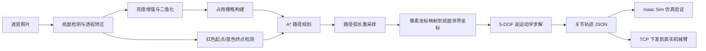

# 基于视觉迷宫识别的五自由度机械臂绘制系统实验报告

## 一、实验概述

本项目围绕“让机械臂根据摄像头拍摄的纸面迷宫自动规划路径并完成描绘”这一目标，完成了从图像处理、路径规划、机械臂运动学求解、仿真验证到真实机械臂通信控制的完整实现。系统输入为一张白纸黑笔绘制的迷宫照片，照片中使用红色标记起点、蓝色标记终点；程序首先对纸面进行透视矫正和二值化重建，再在迷宫中搜索可行路径，最后将路径转换为机械臂末端笔尖的空间轨迹与五个关节角指令。

项目整体结构如下：


实验目标可以概括为四个层次：

| 层次 | 目标 | 对应代码 |
| --- | --- | --- |
| 视觉重建 | 从倾斜拍摄的迷宫照片中恢复正视图和黑白扫描图 | `maze_planner/maze_scanner.py` |
| 路径规划 | 检测红色起点、蓝色终点，基于占用栅格执行 A* 搜索 | `maze_planner/maze_planner.py` |
| 仿真验证 | 在 Isaac Sim 中导入 5-DOF 机械臂并验证笔尖描绘轨迹 | `arm_sim/draw_maze.py`、`arm_sim/arm_kinematics.py` |
| 实机执行 | 将轨迹转换为关节角，通过 TCP + 串口控制真实机械臂 | `arm_real_client/`、`arm_real_server/` |

## 二、硬件与软件平台

### 2.1 硬件平台

实验使用一台五自由度桌面机械臂，末端原夹爪位置改装为固定笔的连接件，使机械臂末端可以作为“绘图笔”在纸面上运动。机械臂通过 USB 串口与下位机 Windows 主机通信，并需要外接 12V 电源供电。

> 待补充图片 1：真实机械臂整体搭建照片  
> 建议文件名：`assets/real_setup.jpg`

> 待补充图片 2：末端笔固定结构近景  
> 建议文件名：`assets/pen_mount.jpg`

机械臂 URDF 模型位于 `urdf/five_dof_arm.urdf`，对应的 STL 网格存放在 `urdf/meshes/`。仿真中使用的零位姿态和可达区域如下。


### 2.2 软件平台

本项目主要使用 Python 实现，核心依赖包括：

- OpenCV：纸面检测、透视变换、二值化、形态学处理和颜色标记检测。
- NumPy / SciPy：坐标变换、路径重采样、正逆运动学计算和优化求解。
- Isaac Sim：机械臂 URDF 导入、仿真场景搭建、离屏渲染和轨迹视频生成。
- socket / pyserial：上位机与下位机 TCP 通信，以及下位机对机械臂串口指令的转发。

项目目录中，`maze_planner/environment.yml` 用于创建迷宫识别和规划环境；Isaac Sim 仿真需要单独配置支持 GPU 渲染的环境。

## 三、系统总体方案

系统从输入照片到真实机械臂绘图的流程如下：



系统采用模块化设计：视觉和路径规划模块只负责生成像素路径；仿真和实机模块共享同一套 `img_to_world` 坐标映射与 `arm_kinematics.py` 运动学求解逻辑，从而保证仿真轨迹和实机轨迹的一致性。

## 四、迷宫图像重建

### 4.1 纸面检测与透视矫正

摄像头拍摄的迷宫照片通常存在倾斜、透视畸变、阴影和背景干扰。`maze_scanner.py` 首先通过亮度与饱和度特征检测白纸区域，若检测失败则退化到 Canny 边缘检测。检测得到四个角点后，程序按左上、右上、右下、左下排序，并执行透视变换，将倾斜纸面恢复为正视图。

关键实现如下：

```python
def four_point_transform(img, rect):
    (tl, tr, br, bl) = rect
    width_top = np.linalg.norm(tr - tl)
    width_bottom = np.linalg.norm(br - bl)
    height_left = np.linalg.norm(bl - tl)
    height_right = np.linalg.norm(br - tr)
    max_w = int(round(max(width_top, width_bottom)))
    max_h = int(round(max(height_left, height_right)))

    dst = np.array([[0, 0],
                    [max_w - 1, 0],
                    [max_w - 1, max_h - 1],
                    [0, max_h - 1]], dtype="float32")
    M = cv2.getPerspectiveTransform(rect, dst)
    return cv2.warpPerspective(img, M, (max_w, max_h))
```

纸面检测效果：


透视矫正后的迷宫图像：


### 4.2 图像增强与二值化

为了降低光照不均和阴影对识别的影响，程序先用大尺度高斯模糊估计背景，再将原图除以背景实现光照归一化，随后使用 CLAHE 增强局部对比度。最后通过自适应阈值将图像转换为黑白扫描图。

```python
def enhance(img):
    gray = cv2.cvtColor(img, cv2.COLOR_BGR2GRAY) if img.ndim == 3 else img
    k = max(31, (max(gray.shape) // 20) | 1)
    background = cv2.GaussianBlur(gray, (k, k), 0)
    background = np.where(background == 0, 1, background)
    norm = gray.astype(np.float32) / background.astype(np.float32)
    norm = np.clip(norm, 0, 1)
    norm = (norm * 255).astype(np.uint8)
    clahe = cv2.createCLAHE(clipLimit=2.0, tileGridSize=(8, 8))
    return clahe.apply(norm)
```

增强图和二值化结果如下：


经过连通域过滤和形态学清理后，得到更适合路径规划的扫描图：


## 五、路径规划算法

### 5.1 起点与终点检测

路径规划模块从透视矫正后的彩色图中检测颜色标记：红色区域作为起点，蓝色区域作为终点。程序将图像转换到 HSV 空间，对红色和蓝色分别设置阈值，并取最大连通域质心作为标记中心。

```python
def detect_markers(bgr):
    hsv = cv2.cvtColor(bgr, cv2.COLOR_BGR2HSV)
    k = np.ones((5, 5), np.uint8)

    red = cv2.inRange(hsv, (0, 80, 40), (10, 255, 255)) | \
          cv2.inRange(hsv, (170, 80, 40), (180, 255, 255))
    red = cv2.morphologyEx(red, cv2.MORPH_OPEN, k)

    blue = cv2.inRange(hsv, (100, 80, 40), (130, 255, 255))
    blue = cv2.morphologyEx(blue, cv2.MORPH_OPEN, k)

    return _largest_blob_centroid(red), _largest_blob_centroid(blue)
```

### 5.2 占用栅格构建

黑色笔迹代表迷宫墙体，白色区域代表可通行区域。程序先将二值图转为墙体栅格，再执行三步处理：

1. 擦除起点和终点标记附近的黑色区域，避免标记被误认为墙。
2. 对墙体做闭运算，修补手绘迷宫中的细小断缝。
3. 对墙体做膨胀，为真实机械臂笔尖或运动误差预留安全距离。

```python
def build_occupancy(binary, markers, close=5, inflate=1, grid_max=400):
    h0, w0 = binary.shape
    wall = (binary < 128).astype(np.uint8)

    erase_r = max(12, int(0.02 * max(h0, w0)))
    for m in markers:
        if m is not None:
            cv2.circle(wall, (int(round(m[0])), int(round(m[1]))),
                       erase_r, 0, -1)

    if close > 0:
        wall = cv2.morphologyEx(wall, cv2.MORPH_CLOSE,
                                np.ones((close, close), np.uint8))

    scale = grid_max / float(max(h0, w0))
    if scale < 1.0:
        gh, gw = max(int(h0 * scale), 1), max(int(w0 * scale), 1)
        wall = (cv2.resize(wall * 255, (gw, gh),
                           interpolation=cv2.INTER_AREA) > 0).astype(np.uint8)

    if inflate > 0:
        wall = cv2.dilate(wall, np.ones((2 * inflate + 1,) * 2, np.uint8))
    return wall.astype(bool), scale
```

生成的占用栅格中，白色为可走区域，黑色为障碍区域：


### 5.3 A* 搜索

本项目使用 8 邻接 A* 算法搜索从起点到终点的最短可行路径。代价函数中直行代价为 1，对角移动代价为 1.414，启发函数采用欧氏距离。为了避免路径从两堵墙形成的对角缝隙中“穿墙”，程序在对角移动时额外检查相邻正交格是否同时为障碍。

```python
def astar(occ, start, goal):
    nbrs = [(-1, 0, 1.0), (1, 0, 1.0), (0, -1, 1.0), (0, 1, 1.0),
            (-1, -1, 1.414), (-1, 1, 1.414),
            (1, -1, 1.414), (1, 1, 1.414)]

    def heur(a, b):
        return ((a[0] - b[0]) ** 2 + (a[1] - b[1]) ** 2) ** 0.5

    open_heap = [(heur(start, goal), 0.0, start)]
    came = {}
    gscore = {start: 0.0}
    while open_heap:
        _, g, cur = heapq.heappop(open_heap)
        if cur == goal:
            path = [cur]
            while cur in came:
                cur = came[cur]
                path.append(cur)
            return path[::-1]
        cr, cc = cur
        for dr, dc, cost in nbrs:
            nr, nc = cr + dr, cc + dc
            if not (0 <= nr < occ.shape[0] and 0 <= nc < occ.shape[1]) or occ[nr, nc]:
                continue
            if dr != 0 and dc != 0 and (occ[cr + dr, cc] and occ[cr, cc + dc]):
                continue
```

最终规划路径叠加在矫正后的迷宫图上，紫色线条为机械臂将要描绘的路径：


## 六、机械臂运动学与轨迹生成

### 6.1 像素坐标到纸面坐标的映射

图像路径点首先按弧长重采样，保证轨迹点分布均匀。随后将矫正图像中的像素坐标映射到真实纸面的物理坐标。项目中纸面尺寸设置为 30 cm × 21 cm，纸面中心相对机械臂底座的位置由 `paper_cx` 和 `paper_cy` 控制。

```python
PAPER_SX, PAPER_SY, PAPER_TOP = 0.30, 0.21, 0.002
PEN_Z = PAPER_TOP + 0.001

def img_to_world(px, py, wimg, himg, paper_cx, paper_cy):
    u, v = px / wimg, py / himg
    return (paper_cx + (0.5 - v) * PAPER_SX,
            paper_cy + (u - 0.5) * PAPER_SY, PEN_Z)
```

这一映射同时用于仿真 `arm_sim/draw_maze.py` 和实机 `arm_real_client/draw_maze_real.py`，因此仿真中看到的纸面轨迹与真实下发轨迹保持一致。

### 6.2 正运动学

`arm_kinematics.py` 按 URDF 中定义的关节 origin、rpy 和 axis 建立 5 个关节的齐次变换链。通过逐级矩阵相乘，可以得到末端 link_5 的位姿，再根据笔尖在 link_5 坐标系下的偏移求出世界坐标中的笔尖位置。

```python
def fk_M5(q):
    M = np.eye(4)
    for (tr, rot, sign), th in zip(_JOINTS, q):
        M = M @ tr @ rot @ _Rz(sign * th)
    return M

def fk_nib_tail(q):
    M5 = fk_M5(q)
    o, R = M5[:3, 3], M5[:3, :3]
    return o + R @ _NIB, o + R @ _TAIL
```

### 6.3 逆运动学

逆运动学求解使用 SciPy 的 SLSQP 有界优化。求解目标分为两个优先级：

1. 优先保证笔尖位置到达目标点。
2. 在位置满足约束后，优化笔轴朝向，使笔尽量竖直向下，同时保留末端绕笔轴旋转的自由度。

```python
def ik(target, q0, lim=None, debug=True, command_offsets_deg=None):
    target = np.asarray(target, float)
    q_ref = np.clip(np.asarray(q0, float), joint_lo, joint_hi)

    def pos_cost(q):
        err = fk_pos(q) - target
        return float(err @ err)

    pos_res = minimize(pos_cost, q_ref, method="SLSQP", bounds=bounds,
                       options={"maxiter": 250, "ftol": 1e-12})
    q_pos = np.clip(pos_res.x if pos_res.x is not None else q_ref,
                    joint_lo, joint_hi)

    def orient_cost(q):
        a = _pen_axis(q)
        return float((1.0 + a[2]) + _CONTINUITY_W * np.sum((q - q_ref) ** 2))

    constraints = ({"type": "eq", "fun": lambda q: fk_pos(q) - target},)
    orient_res = minimize(orient_cost, q_pos, method="SLSQP",
                          bounds=bounds, constraints=constraints)
```

当前轨迹文件 `maze_planner/outputs/trajectory/trajectory.json` 中保存了 120 个轨迹点，元信息显示：

| 指标 | 数值 |
| --- | --- |
| 输入图片 | `maze_planner/samples/test_0.jpg` |
| 轨迹点数 | 120 |
| 纸面中心距底座 | `paper_cx = 0.33 m` |
| 点间时间 | `dt = 0.1 s` |
| 最大 IK 位置残差 | 约 `5.81e-10 mm` |
| 最大笔轴偏离竖直角 | 约 `16.50°` |

轨迹点同时保存关节角 `b/s/e/w/h` 和对应的纸面世界坐标 `x/y/z`，便于仿真复现和实机下发。

## 七、Isaac Sim 仿真验证

仿真模块将机械臂 URDF 导入 Isaac Sim，并把重建后的迷宫图作为纸面纹理贴到 30 cm × 21 cm 的平面上。程序逐点设置机械臂关节角，同时用红色轨迹点显示笔尖已走过的路径，最后渲染为 MP4 视频。

主要流程位于 `arm_sim/draw_maze.py`：

```python
pts, warped, binary, start_xy, goal_xy = solve_path(MAZE_IMG, auto=True, debug_dir=_IMG_DIR)
path_px = resample(pts, N_WAYPOINTS)

targets = [img_to_world(px, py, wimg, himg) for px, py in path_px]
qtraj, res, tilt = [], [], []
q_seed = np.array([0.0, 1.0, 1.0, 0.0, 0.0])
for tgt in targets:
    q_seed, e, ti = ik(np.array(tgt), q_seed)
    qtraj.append(q_seed.copy())
    res.append(e)
    tilt.append(ti)
```

仿真输出文件：

| 文件 | 内容 |
| --- | --- |
| `arm_sim/video/arm_motion.mp4` | 五个关节正弦运动展示 |
| `arm_sim/video/arm_draw_circle.mp4` | 画圆验证 FK/IK 链路 |
| `arm_sim/video/arm_draw_maze.mp4` | 沿迷宫路径描绘的完整仿真视频 |

> 可在报告提交版中插入视频截图。  
> 待补充图片 3：`arm_draw_maze.mp4` 中机械臂描绘迷宫的关键帧截图  
> 建议文件名：`assets/sim_draw_maze_frame.jpg`

## 八、真实机械臂控制实现

### 8.1 上下位机通信链路

真实机械臂控制采用“上位机规划 + 下位机执行”的结构。上位机负责图像处理、路径规划、IK 求解和轨迹文件生成；下位机运行在 Windows 上，直接通过 pyserial 访问机械臂串口，并对上位机开放 TCP 服务。

```text
上位机 draw_maze_real.py / robot_client.py
        |
        | TCP JSON, port 9001
        v
下位机 robot_server.py
        |
        | pyserial, COM10, 115200
        v
机械臂主控板
```

`robot_client.py` 将所有请求封装为一行 JSON，通过 TCP 发送给服务器：

```python
class RobotClient:
    def request(self, payload):
        msg = json.dumps(payload, separators=(",", ":")) + "\n"
        with socket.create_connection((self.host, self.port), timeout=self.timeout) as sock:
            sock.sendall(msg.encode("utf-8"))
            data = sock.recv(4096)
        return json.loads(data.decode("utf-8"))

    def trajectory(self, points, dt=DEFAULT_DT, traj_id="traj",
                   spd=DEFAULT_SPD, acc=DEFAULT_ACC):
        return self.request({
            "type": "trajectory",
            "traj_id": traj_id,
            "dt": dt,
            "spd": spd,
            "acc": acc,
            "points": points,
        })
```

### 8.2 下位机串口指令

下位机服务端将上位机传来的关节角转换为机械臂底层 JSON 串口协议。关节控制指令使用 `T=122`，包括底座 `b`、肩关节 `s`、肘关节 `e`、腕关节 `w` 和末端 `h`，并附带速度和加速度。

```python
def make_arm_cmd(point, global_spd=None, global_acc=None):
    cmd = {"T": 122}
    for joint, (lo, hi) in LIMITS.items():
        value = point.get(joint, 0.0)
        cmd[joint] = clamp(value, lo, hi)
    cmd["spd"] = point.get("spd", global_spd if global_spd is not None else DEFAULT_SPD)
    cmd["acc"] = point.get("acc", global_acc if global_acc is not None else DEFAULT_ACC)
    return cmd
```

服务端同时提供以下请求类型：

| 请求类型 | 功能 |
| --- | --- |
| `ping` | 测试上位机与下位机连通性 |
| `joint` | 下发单个关节目标点 |
| `trajectory` | 异步接收并执行整条轨迹 |
| `status` | 查询服务端当前执行状态 |
| `state` | 查询机械臂底层状态返回 |
| `stop` | 请求停止后续轨迹点下发 |

### 8.3 轨迹执行策略

服务端接收到轨迹后会启动独立线程执行。当前实现采用“发送一个点，等待到位，再发送下一个点”的策略。到位判断不依赖单一的目标角误差，而是通过连续多次读取关节反馈，判断角度是否已经稳定，从而适应真实硬件状态反馈中存在的符号差异、噪声和 `move` 字段不稳定问题。

这种策略的优点是执行更稳健，缺点是速度受限于状态轮询和逐点等待。对于绘图任务而言，稳定性优先级高于速度，因此该策略是合理的。

> 待补充图片 4：真实机械臂开始描绘迷宫路径  
> 建议文件名：`assets/real_drawing_start.jpg`

> 待补充图片 5：真实机械臂绘制完成后的纸面结果  
> 建议文件名：`assets/real_result.jpg`

## 九、实验步骤

### 9.1 迷宫识别与规划

```bash
conda env create -f maze_planner/environment.yml
conda activate maze
python maze_planner/maze_planner.py maze_planner/samples/test_0.jpg -o maze_planner/outputs/image/planned.png --auto
```

运行后会在 `maze_planner/outputs/image/` 中生成从输入图、纸面检测、透视矫正、二值化、占用栅格到规划结果的全部中间图。

### 9.2 仿真绘制

```bash
python arm_sim/draw_maze.py
```

输出视频位于：

```text
arm_sim/video/arm_draw_maze.mp4
```

### 9.3 实机轨迹生成与 dry-run 校验

```bash
python arm_real_client/draw_maze_real.py
```

默认模式只进行规划、IK 求解、限位检查和轨迹文件保存，不会连接机械臂。轨迹文件输出到：

```text
maze_planner/outputs/trajectory/trajectory.json
```

### 9.4 实机少量点试运行

首次上真机时，建议只发送前几个点，确认笔尖落点、纸面摆放方向和机械臂运动方向均正确：

```bash
python arm_real_client/draw_maze_real.py --send --from-file --max-points 5
```

### 9.5 实机完整运行

确认无误后再发送完整轨迹：

```bash
python arm_real_client/draw_maze_real.py --send --from-file
```

运行过程中如需停止，可执行：

```bash
python arm_real_client/estop.py
```

需要注意，当前 `estop.py` 是软件停止：它会阻止后续轨迹点继续下发，但不等价于切断电源的硬急停。

## 十、实验结果与分析

### 10.1 图像处理结果

从输出图像可以看到，系统能够从倾斜拍摄的原始照片中检测纸面边界，并将其矫正为适合规划的俯视图。经过亮度增强和二值化后，黑色迷宫墙体较为清晰，后续占用栅格能够较准确地表达通道结构。


### 10.2 路径规划结果

规划结果显示，A* 算法能够从红色起点连通到蓝色终点，并生成一条避开墙体的路径。通过墙体膨胀和对角穿墙检查，路径不会贴墙过近，也不会利用不真实的像素缝隙穿过迷宫墙。

### 10.3 运动学结果

轨迹文件中保存的 IK 位置残差极小，说明在当前纸面位置设置下，机械臂运动学模型可以覆盖整条迷宫路径。最大笔轴偏离竖直角约为 16.50°，说明某些位置受关节限位影响，笔无法完全竖直，但仍能保持可绘制姿态。

### 10.4 实机结果

本仓库当前未包含实机运行照片，因此本节预留补图位置。后续补充真实运行图后，可从以下几个方面分析：

| 待观察项目 | 说明 |
| --- | --- |
| 起点落点误差 | 笔尖是否准确落在红色起点附近 |
| 路径偏移 | 实际笔迹与规划路径是否存在整体偏移或比例误差 |
| 转弯质量 | 迷宫拐角处是否出现明显圆角、抖动或过冲 |
| 墙体碰撞 | 笔迹是否穿过或过度接近黑色墙体 |
| 终点误差 | 绘制结束点是否到达蓝色终点附近 |

> 待补充图片 6：实机最终绘制结果与规划图对比  
> 建议文件名：`assets/real_vs_plan.jpg`

## 十一、问题与改进方向

1. 纸面标定仍依赖手工摆放。当前通过 `paper_cx`、`paper_cy` 假设纸面位于固定位置，若纸面实际摆放偏移，会造成整体绘图偏移。后续可加入 ArUco 标记或相机-机械臂外参标定。
2. 实机轨迹是逐点到位执行。该方法稳定，但速度较慢。后续可以实现连续轨迹插补或速度规划，使笔迹更平滑。
3. 笔压控制仍可进一步优化。服务端已经预留基于力矩反馈估计笔尖竖直力的 `force-z-adaptive` 逻辑，后续可通过标定提升笔压一致性。
4. 末端笔姿态受关节限位约束。若希望笔始终更接近竖直，需要进一步优化纸面摆放位置、末端结构长度，或放宽确认安全的关节限位。
5. 视觉部分对光照和纸张背景仍有依赖。后续可以加入更鲁棒的阈值策略、边缘拟合或学习式分割方法。

## 十二、实验结论

本实验完成了一个“视觉识别迷宫 - 路径规划 - 机械臂轨迹生成 - 仿真/实机执行”的完整系统。视觉模块能够从普通拍摄照片中恢复迷宫结构，路径规划模块能够基于占用栅格生成可行路径，运动学模块能够将二维路径转换为五自由度机械臂关节角轨迹，仿真模块验证了机械臂沿路径描绘的可行性，实机控制模块则提供了 TCP + 串口的完整下发链路。

项目的核心价值在于将传统图像处理、搜索算法、机械臂运动学和上下位机通信组合成了一个闭环机器人系统。相较于单独的图像识别或单独的机械臂控制，本项目更突出系统集成能力：输入是一张迷宫照片，输出是真实机械臂能够执行的绘图轨迹。

## 附录：关键文件说明

| 文件 | 作用 |
| --- | --- |
| `maze_planner/maze_scanner.py` | 完成纸面检测、透视矫正、亮度增强、二值化和清理 |
| `maze_planner/maze_planner.py` | 完成起终点检测、占用栅格构建和 A* 路径规划 |
| `arm_sim/arm_kinematics.py` | 实现 5-DOF 机械臂正逆运动学 |
| `arm_sim/draw_maze.py` | 在 Isaac Sim 中渲染机械臂绘制迷宫过程 |
| `arm_real_client/draw_maze_real.py` | 将迷宫路径转换为实机关节轨迹并下发 |
| `arm_real_client/robot_client.py` | 上位机 TCP 客户端封装 |
| `arm_real_server/robot_server.py` | 下位机 TCP 服务与串口控制 |
| `maze_planner/outputs/image/` | 保存图像处理和规划中间结果 |
| `maze_planner/outputs/trajectory/trajectory.json` | 保存实机可执行的关节轨迹 |
